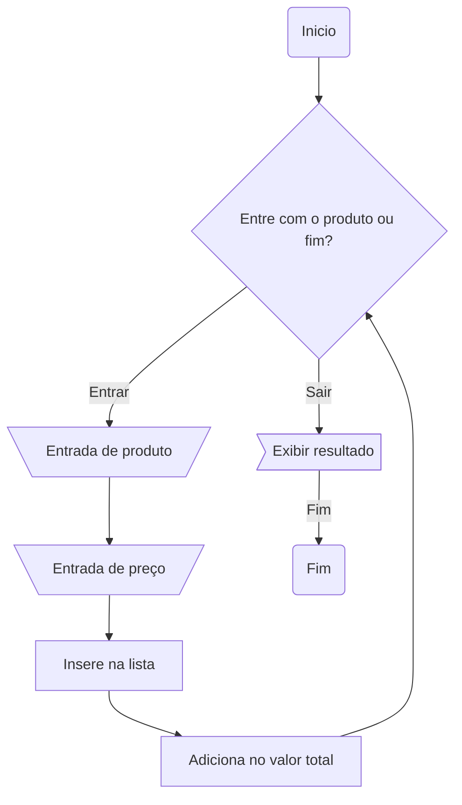

# Gráfico do Desafio de compras

```mermaid
flowchart TD

Inicio(Inicio) --> Decisao{Entre com o produto ou fim?};

Decisao -- Entrar --> Entrada[\Entrada de produto/];
Entrada --> Entrada_preco[\Entrada de preço/];
Entrada_preco --> Preenche[Insere na lista];
Preenche --> Soma_total[Adiciona no valor total];
Soma_total --> Decisao;

Decisao -- Sair --> Exibir>Exibir resultado];
Exibir -- Fim --> Fim(Fim);
```
